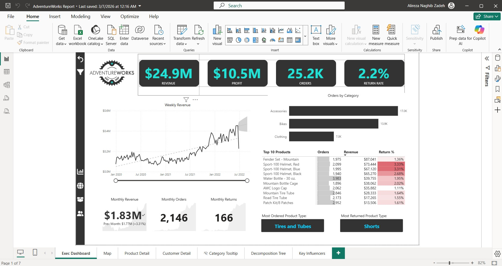
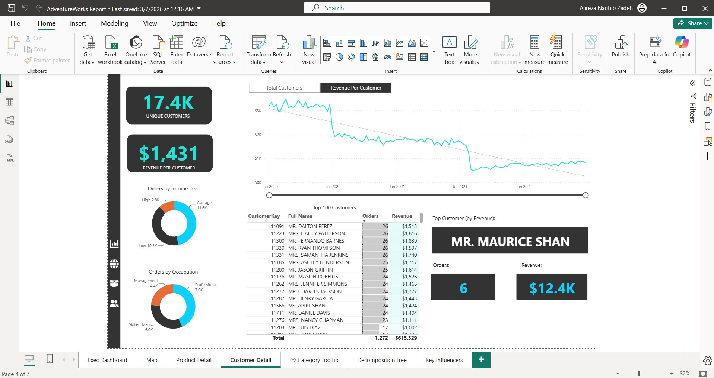
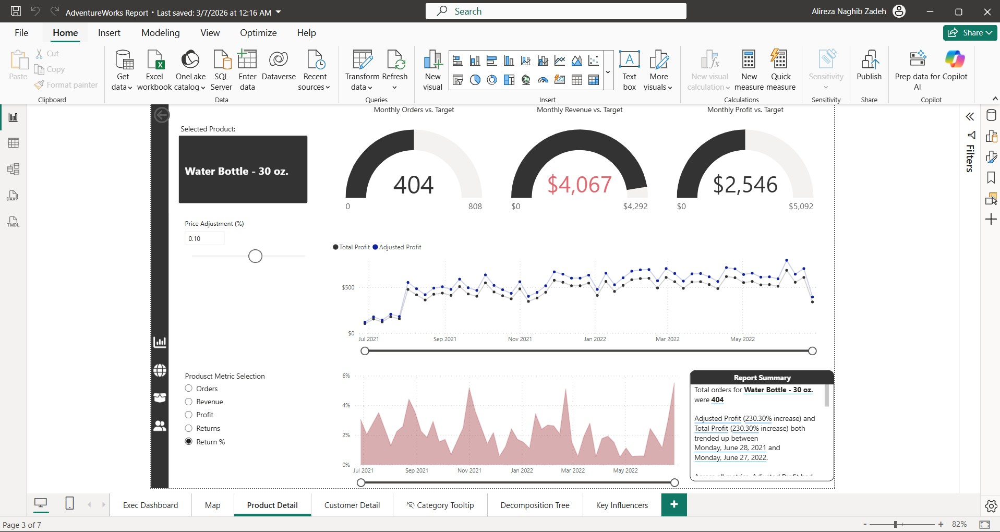

# Power BI Sales Analytics Dashboard

## Project Overview

This project presents a comprehensive Sales Analytics Dashboard built using Power BI, designed to enable data-driven decision-making for business stakeholders.

Using the AdventureWorks dataset, the dashboard provides insights into sales performance, customer behavior, and product trends through interactive visualizations and KPIs.

## Business Objective

The goal of this project is to:
- Monitor key business KPIs (Revenue, Profit, Orders, Return Rate)
- Analyze regional and product-level performance
- Identify high-value customers and sales trends
- Enable stakeholders to make strategic decisions using data

## Key KPIs

- Revenue
- Profit
- Orders
- Return Rate

## Tools & Technologies

- Power BI
- Power Query (ETL)
- DAX (Data Analysis Expressions)

## Project Workflow

1.	Data Cleaning & Transformation
- Processed raw data using Power Query
- Handled missing values and data inconsistencies
2.	Data Modeling
- Built relationships between fact and dimension tables
- Designed a star schema for optimized performance
3.	DAX Calculations
- Created measures for KPIs (Revenue, Profit, Return Rate)
- Implemented time intelligence functions
4.	Dashboard Development
- Designed interactive dashboards with filters and slicers
- Enabled drill-down and cross-filtering

## Dashboard Features

- Executive Summary View
- Regional Sales Analysis (Map Visualization)
- Product-Level Performance Insights
- Customer Segmentation & Behavior Analysis
- Decomposition Tree for root cause analysis

## Dashboard Screenshots

### Executive Dashboard

### Customer Analysis

### Product Analysis

## Key Insights

- Identified top-performing products contributing to revenue
- Analyzed regions with highest and lowest sales performance
- Detected customer segments driving maximum profit
- Evaluated return rate impact on overall profitability

## Future Improvements

- Integration with real-time data sources
- Advanced forecasting using time-series models
- Deployment via Power BI Service

## Contact

- LinkedIn: https://www.linkedin.com/in/alireza-naghibzadeh
- Email: alireza.naghibzadeh@hotmail.com
- GitHub: https://github.com/InfoDelta
